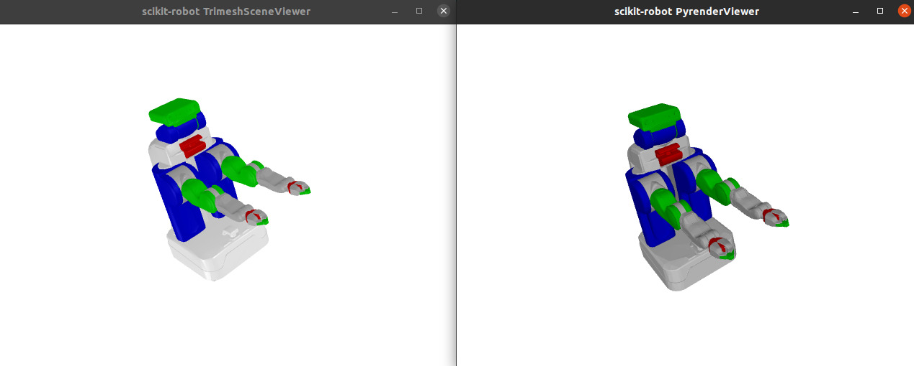
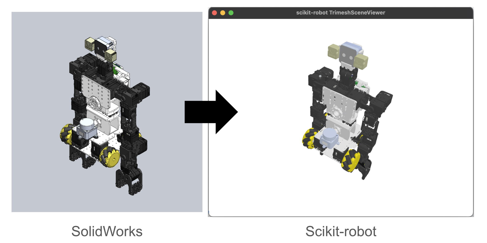

# scikit-robot: A Flexible Framework for Robot visualization and programming in Python


[](https://github.com/iory/scikit-robot/actions)


<h4>
    <a href="https://scikit-robot.readthedocs.io/en/latest/">Documentation</a> |
    <a href="https://scikit-robot.readthedocs.io/en/latest/install/index.html">Installation</a> |
    <a href="https://scikit-robot.readthedocs.io/en/latest/examples/index.html">Quick Start</a> |
    <a href="https://scikit-robot.readthedocs.io/en/latest/reference/index.html">Python API</a> |
    <a href="https://scikit-robot.readthedocs.io/en/latest/development/index.html">Contribute</a>
</h4>

Scikit-Robot is a lightweight pure-Python library for robotic kinematics,
motion planning, visualization and control.

## Installation
You may need to install some dependencies by apt-get install:
```bash
sudo apt-get update
sudo apt-get install libspatialindex-dev freeglut3-dev libsuitesparse-dev libblas-dev liblapack-dev
```

Then,
```bash
pip install scikit-robot
```

If you would like to use `Pybullet Interface`, `open3d` and `fast-simplification` for mesh simplification,

```bash
pip install scikit-robot[all]
```

## Command Line Tools

### Visualize URDF

To visualize a URDF model and inspect your robot's configuration, you can use the `visualize-urdf` command as follows:

```bash
visualize-urdf ~/.skrobot/pr2_description/pr2.urdf
```

If you experience performance issues with the default viewer, try pyrender for smoother visualization:

```bash
visualize-urdf ~/.skrobot/pr2_description/pr2.urdf --viewer pyrender
```

Running these commands should open a viewer displaying your robot’s 3D model. Below is a sample image of what you should expect.



## Create Your Own Robot Model (URDF)

If you want to build your own robot from scratch, you can refer to the [How to Create URDF from CAD Software](https://scikit-robot.readthedocs.io/en/latest/reference/how_to_create_urdf_from_cad.html) documentation.




## Features

- [x] Loading robot model from URDF ([examples/robot_models.py](examples/robot_models.py))
- [x] Forward and inverse kinematics ([examples/trimesh_scene_viewer.py](examples/trimesh_scene_viewer.py))
- [x] Collision detection
- [x] Interactive viewer ([examples/trimesh_scene_viewer.py](examples/trimesh_scene_viewer.py))
- [x] Pybullet and ROS command interface ([examples/pybullet_robot_interface.py](examples/pybullet_robot_interface.py))
- [ ] Forward and inverse dynamics
- [x] Path planning ([examples/collision_free_trajectory.py](examples/collision_free_trajectory.py))
