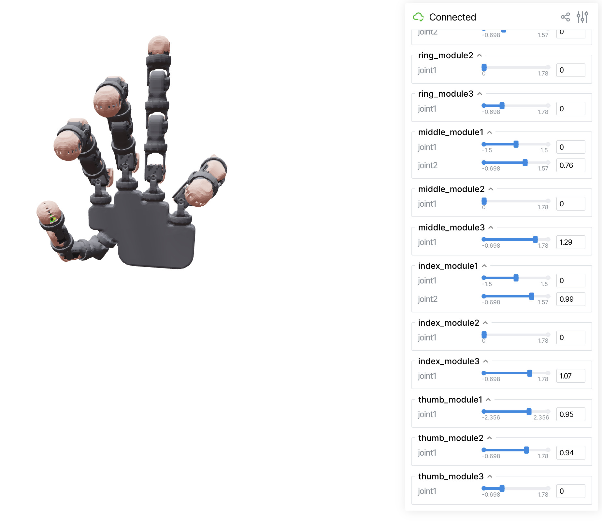

# scikit-robot: A Flexible Framework for Robot visualization and programming in Python


[](https://github.com/iory/scikit-robot/actions)
[](https://colab.research.google.com/github/iory/scikit-robot/blob/main/examples/notebooks/colab_jupyter_viewer_demo.ipynb)


<h4>
    <a href="https://scikit-robot.readthedocs.io/en/latest/">Documentation</a> |
    <a href="https://scikit-robot.readthedocs.io/en/latest/install/index.html">Installation</a> |
    <a href="https://scikit-robot.readthedocs.io/en/latest/examples/index.html">Quick Start</a> |
    <a href="https://scikit-robot.readthedocs.io/en/latest/reference/index.html">Python API</a> |
    <a href="https://scikit-robot.readthedocs.io/en/latest/development/index.html">Contribute</a>
</h4>

Scikit-Robot is a lightweight pure-Python library for robotic kinematics,
motion planning, visualization and control.

## Installation
You may need to install some dependencies by apt-get install:
```bash
sudo apt-get update
sudo apt-get install libspatialindex-dev freeglut3-dev libsuitesparse-dev libblas-dev liblapack-dev
```

Then,
```bash
pip install scikit-robot
```

If you would like to use `Pybullet Interface`, `open3d` and `fast-simplification` for mesh simplification,

```bash
pip install scikit-robot[all]
```

## Command Line Tools

Scikit-robot provides a unified command-line interface through the `skr` command, which consolidates all robot-related tools into a single entry point.

### Using the skr Command

You can use the `skr` command with various subcommands:

```bash
# View all available commands
skr --help

# Visualize URDF models
skr visualize-urdf ~/.skrobot/pr2_description/pr2.urdf --viewer trimesh

# Convert URDF mesh files
skr convert-urdf-mesh robot.urdf --output converted_robot.urdf

# Change URDF root link
skr change-urdf-root robot.urdf new_root_link output.urdf

# Calculate URDF hash
skr urdf-hash robot.urdf

# Modularize URDF files
skr modularize-urdf robot.urdf --output modular_robot.urdf

# Visualize mesh files
skr visualize-mesh mesh_file.stl

# Convert wheel collision models
skr convert-wheel-collision robot.urdf --output converted.urdf

# Generate robot class from URDF geometry
skr generate-robot-class robot.urdf --output MyRobot.py
```

### Legacy Commands (still supported)

For backward compatibility, the original commands are still available:

```bash
# These commands work the same as their skr equivalents
visualize-urdf ~/.skrobot/pr2_description/pr2.urdf --viewer trimesh
convert-urdf-mesh robot.urdf --output converted_robot.urdf
```

### Visualize URDF

To visualize a URDF model and inspect your robot's configuration:

```bash
skr visualize-urdf ~/.skrobot/pr2_description/pr2.urdf --viewer trimesh
```

If you experience performance issues with the default viewer, try pyrender for smoother visualization:

```bash
skr visualize-urdf ~/.skrobot/pr2_description/pr2.urdf --viewer pyrender
```

For a web-based viewer with interactive joint angle sliders, use viser:

```bash
skr visualize-urdf ~/.skrobot/pr2_description/pr2.urdf --viewer viser
```

Running these commands should open a viewer displaying your robot's 3D model. Below is a sample image of what you should expect.


The viser viewer opens in your browser and provides GUI sliders for manipulating joint angles in real-time:



The viser viewer also supports interactive inverse kinematics (IK). Drag the transform controls at each end-effector to solve IK in real-time:

https://github.com/user-attachments/assets/1294307e-a901-4f5f-aa4e-433cfbfacd03

## Create Your Own Robot Model (URDF)

If you want to build your own robot from scratch, you can refer to the [How to Create URDF from CAD Software](https://scikit-robot.readthedocs.io/en/latest/reference/how_to_create_urdf_from_cad.html) documentation.


## Try it in Google Colab!

You can try scikit-robot directly in your browser without any installation:

[](https://colab.research.google.com/github/iory/scikit-robot/blob/main/examples/notebooks/colab_jupyter_viewer_demo.ipynb)

This interactive notebook demonstrates:
- Multiple robot models (Kuka, Fetch, Nextage, PR2, Panda) with synchronized animation
- Grasp and pull manipulation task with inverse kinematics
- 3D visualization in Jupyter/Colab with smooth updates

## Jupyter Notebook Viewer

Scikit-robot includes `JupyterNotebookViewer` for interactive 3D visualization in Jupyter notebooks and Google Colab:

```python
import skrobot

# Create robot and viewer
robot = skrobot.models.PR2()
viewer = skrobot.viewers.JupyterNotebookViewer(height=600)
viewer.add(robot)

# Display and animate
viewer.show()

for _ in range(10):
    robot.rarm.angle_vector([0.1, 0.2, 0.3, 0.4, 0.5, 0.6, 0.7])
    viewer.redraw()  # Smooth updates without flickering
```

See [examples/notebooks/](examples/notebooks/) for more examples.

## Features

- [x] Loading robot model from URDF ([examples/robot_models.py](examples/robot_models.py))
- [x] Forward and inverse kinematics ([examples/trimesh_scene_viewer.py](examples/trimesh_scene_viewer.py) [examples/pr2_inverse_kinematics.py](examples/pr2_inverse_kinematics.py))
- [x] Collision detection
- [x] Interactive viewer ([examples/trimesh_scene_viewer.py](examples/trimesh_scene_viewer.py))
- [x] Jupyter notebook viewer ([examples/notebooks/](examples/notebooks/))
- [x] Pybullet and ROS command interface ([examples/pybullet_robot_interface.py](examples/pybullet_robot_interface.py))
- [x] Forward and inverse dynamics
- [x] Path planning ([examples/collision_free_trajectory.py](examples/collision_free_trajectory.py))
