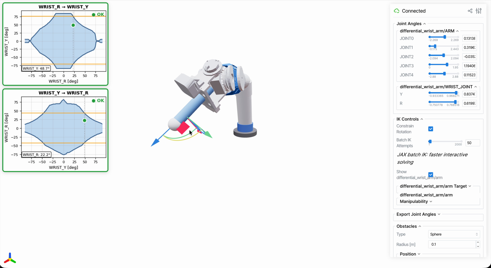

===================
Joint Limit Tables
===================

**Example script**: ``examples/differential_wrist_joint_limit_demo.py``

This guide explains Joint Limit Tables, a feature for handling dynamic joint limits
where one joint's valid range depends on another joint's current angle.

What are Joint Limit Tables?
============================

In standard robot models, each joint has fixed minimum and maximum angle limits.
However, some mechanical designs have **coupled joint constraints** where moving
one joint changes the valid range of another joint.

   Joint limit tables visualize the valid region (blue) where the dependent joint
   can move based on the target joint's angle. The green dot shows the current
   position is within limits.

Common examples include:

- **Differential wrist mechanisms**: The roll and pitch joints share tendons/gears
- **Cable-driven robots**: Cable routing creates coupled constraints
- **Parallel link mechanisms**: Kinematic coupling between joints

The Joint Limit Table feature allows you to define these dynamic relationships.

Basic Concept
-------------

A Joint Limit Table defines:

- **Target Joint**: The joint whose angle determines the limits
- **Dependent Joint**: The joint whose limits change based on the target
- **Sample Angles**: Discrete angles of the target joint
- **Min/Max Angles**: The dependent joint's limits at each sample angle

.. code-block:: text

   Target Joint Angle:  -90°  -45°   0°   45°   90°
                         |     |     |     |     |
   Dependent Min:      -10°  -30°  -50°  -30°  -10°
   Dependent Max:       10°   30°   50°   30°   10°

The limits are linearly interpolated between sample points.

DifferentialWristSample Robot
=============================

scikit-robot includes a sample robot with a differential wrist mechanism:

.. code-block:: python

   from skrobot.models import DifferentialWristSample

   # Load robot with joint limit tables enabled (default)
   robot = DifferentialWristSample(use_joint_limit_table=True)

   # The wrist joints have coupled constraints
   wrist_y = robot.WRIST_JOINT_Y  # Pitch
   wrist_r = robot.WRIST_JOINT_R  # Roll

   # Check current dynamic limits
   print(f"WRIST_R min: {wrist_r.min_angle}")  # Changes with WRIST_Y
   print(f"WRIST_R max: {wrist_r.max_angle}")  # Changes with WRIST_Y

Defining Joint Limit Tables
===========================

Joint limit tables are defined in YAML format:

.. code-block:: yaml

   joint_limit_tables:
     # WRIST_JOINT_Y affects WRIST_JOINT_R limits
     - target_joint: WRIST_JOINT_Y
       dependent_joint: WRIST_JOINT_R
       target_min_angle: -90  # degrees
       target_max_angle: 90   # degrees
       min_angles: [-10, -20, -50, -20, -10]  # at each sample point
       max_angles: [10, 20, 50, 20, 10]       # at each sample point

     # WRIST_JOINT_R affects WRIST_JOINT_Y limits (bidirectional)
     - target_joint: WRIST_JOINT_R
       dependent_joint: WRIST_JOINT_Y
       target_min_angle: -90
       target_max_angle: 90
       min_angles: [-15, -25, -45, -25, -15]
       max_angles: [15, 25, 45, 25, 15]

Apply the tables to a robot:

.. code-block:: python

   import yaml
   from skrobot.model import create_joint_limit_table

   with open('joint_limits.yaml', 'r') as f:
       config = yaml.safe_load(f)

   for table_config in config['joint_limit_tables']:
       create_joint_limit_table(
           robot,
           table_config['target_joint'],
           table_config['dependent_joint'],
           table_config['target_min_angle'],
           table_config['target_max_angle'],
           table_config['min_angles'],
           table_config['max_angles'],
       )

Using Joint Limit Tables with IK
================================

Joint limit tables are automatically respected by the IK solver:

.. code-block:: python

   from skrobot.models import DifferentialWristSample

   robot = DifferentialWristSample(use_joint_limit_table=True)
   robot.reset_manip_pose()

   # IK will respect dynamic joint limits
   target_coords = robot.end_coords.copy_worldcoords()
   target_coords.translate([0.05, 0, 0])

   robot.inverse_kinematics(
       target_coords,
       link_list=robot.arm.link_list,
       move_target=robot.end_coords,
   )

   # The solution will satisfy coupled constraints
   print(f"WRIST_Y: {robot.WRIST_JOINT_Y.joint_angle()}")
   print(f"WRIST_R: {robot.WRIST_JOINT_R.joint_angle()}")

Batch IK with Dynamic Limits
----------------------------

For batch IK, dynamic limits are also supported:

.. code-block:: python

   import numpy as np
   from skrobot.coordinates import Coordinates
   from skrobot.models import DifferentialWristSample

   robot = DifferentialWristSample(use_joint_limit_table=True)
   robot.reset_manip_pose()

   # Create multiple target poses
   base_pos = robot.end_coords.worldpos()
   target_coords = []
   for i in range(100):
       offset = np.random.uniform(-0.05, 0.05, size=3)
       c = Coordinates(pos=base_pos + offset, rot=robot.end_coords.worldrot())
       target_coords.append(c)

   # Solve batch IK (automatically handles dynamic limits)
   solutions, success_flags, _ = robot.batch_inverse_kinematics(
       target_coords,
       link_list=robot.arm.link_list,
       move_target=robot.end_coords,
       stop=50,
       attempts_per_pose=3,
   )

   print(f"Success rate: {sum(success_flags)}/{len(success_flags)}")
   # All successful solutions satisfy dynamic constraints

Visualization Demo
==================

The demo script visualizes joint limit tables in real-time:

.. code-block:: bash

   python examples/differential_wrist_joint_limit_demo.py

Move the joint sliders or drag the end-effector gizmo to see how the valid
region changes dynamically.

Key Concepts
============

Dynamic ``min_angle`` and ``max_angle``
---------------------------------------

When a joint has a limit table, its ``min_angle`` and ``max_angle`` properties
become dynamic:

.. code-block:: python

   # Without limit table: fixed values
   print(joint.min_angle)  # Always returns same value

   # With limit table: depends on target joint
   robot.WRIST_JOINT_Y.joint_angle(0)
   print(robot.WRIST_JOINT_R.min_angle)  # e.g., -50 degrees

   robot.WRIST_JOINT_Y.joint_angle(1.0)
   print(robot.WRIST_JOINT_R.min_angle)  # e.g., -30 degrees

Bidirectional Constraints
-------------------------

In differential mechanisms, constraints are often bidirectional:

- Moving WRIST_Y changes WRIST_R's limits
- Moving WRIST_R changes WRIST_Y's limits

Both directions should be defined for proper constraint handling.

JointLimitTable Class
---------------------

Access the underlying table object:

.. code-block:: python

   table = robot.WRIST_JOINT_R.joint_min_max_table

   # Get limits at a specific target angle
   min_val = table.min_angle_function(target_angle)
   max_val = table.max_angle_function(target_angle)

   # Access raw data
   print(table.sample_angles)  # Target joint sample points
   print(table.min_angles)     # Min limits at each sample
   print(table.max_angles)     # Max limits at each sample

API Reference
=============

Creating Joint Limit Tables
---------------------------

.. autofunction:: skrobot.model.create_joint_limit_table

JointLimitTable Class
---------------------

.. autoclass:: skrobot.model.JointLimitTable
   :members:
   :undoc-members:

Related Examples
================

- :doc:`batch_ik` - Batch IK solving with JAX
- :doc:`reachability_map` - Reachability analysis

Source Code
===========

Full source: https://github.com/iory/scikit-robot/blob/main/examples/differential_wrist_joint_limit_demo.py
