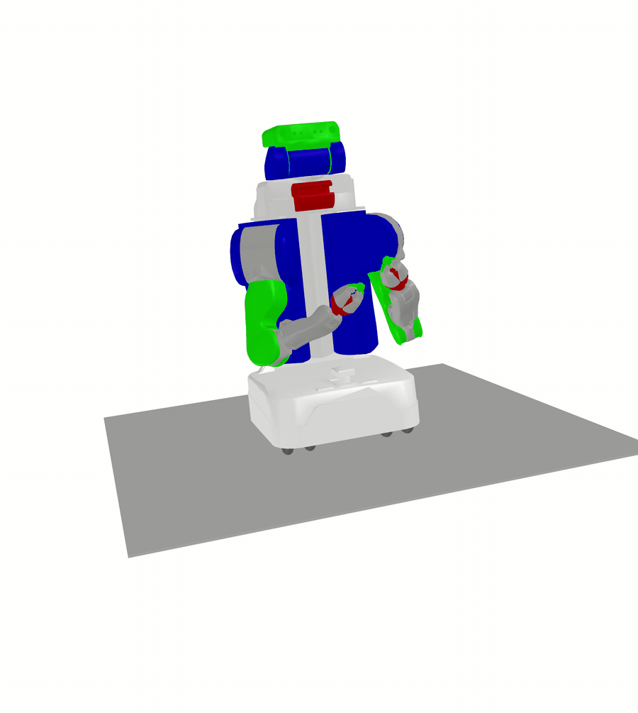

=======================================
Scikit-Robot -- A Library for Robotitcs
=======================================

Scikit-Robot is a simple pure-Python library for loading, manipulating, and exporting
URDF files and robot specifications. For example, here's a rendering of a UR5
robot moving around after being loaded by this library.

.. toctree::
   :maxdepth: 2

   install/index.rst
   examples/index.rst
   reference/index.rst
   development/index.rst

Indices and tables
==================

* :ref:`genindex`
* :ref:`modindex`
* :ref:`search`
