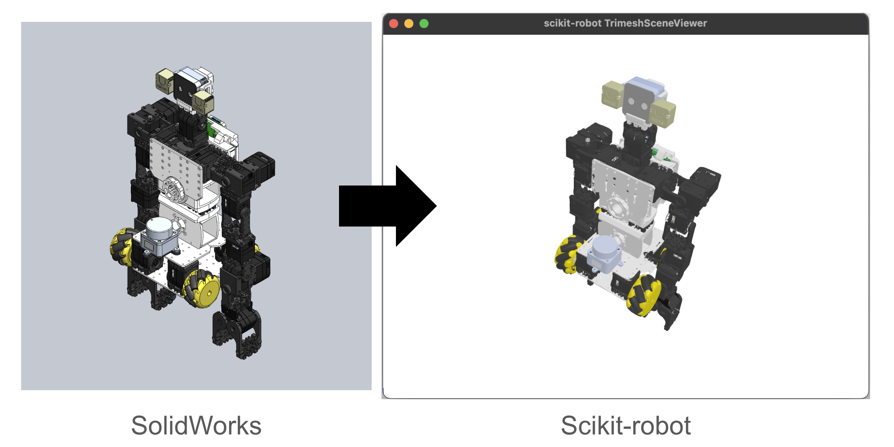

How to Create URDF from CAD Software
====================================

Overview
--------

This document explains how to create a URDF file from SolidWorks models by using:

1. SolidWorks to URDF Exporter
2. scikit-robot's ``convert-urdf-mesh`` command

- **SolidWorks to URDF Exporter**
  This exporter helps convert SolidWorks assemblies into a format (3dxml) which is more easily processed to produce URDF-compatible mesh files.

- **scikit-robot ``convert-urdf-mesh``**
  A tool within the `scikit-robot <https://github.com/iory/scikit-robot>`_ library that can convert 3D model files (like ``.3dxml``, ``.obj``, ``.stl``, etc.) into a URDF or mesh files (e.g., ``.dae``) suitable for ROS.

Recommended: sw2robot (solidworks_urdf_exporter2)
-------------------------------------------------

If you are starting a new project, we recommend using
`sw2robot (solidworks_urdf_exporter2) <https://github.com/jsk-ros-pkg/solidworks_urdf_exporter2>`_
together with scikit-robot. It is the modernized successor of the classic
SolidWorks URDF Exporter and pairs well with ``convert-urdf-mesh``.

Compared with the classic exporter, sw2robot:

- **Infers the kinematic tree automatically** by reading the assembly's existing
  mates (constraints), instead of asking you to lay out the link hierarchy and
  set each joint origin/axis by hand inside SolidWorks.
- **Ships a cross-platform browser editor** so that the *edit / build / export*
  steps run natively on Windows, macOS, and Linux (only the *extract* step, which
  drives SolidWorks over COM, needs Windows + SolidWorks). You can re-root the
  tree, change joint types, edit frames, set materials/densities, and export a
  ROS / robot-compiler package.
- **Works on any URDF**, so you can also open a URDF produced by the classic
  add-in and clean it up in the editor.

**Exports URDF + meshes directly (no ``convert-urdf-mesh`` step needed).**
sw2robot writes the URDF together with its mesh files for you, so with sw2robot
you typically do *not* need to post-process the output with
``convert-urdf-mesh``. In particular it can:

- **Emit visual meshes directly as ``.glb`` (or ``.dae`` / ``.stl``)**, keeping
  per-part materials/colors — no separate 3dxml→dae conversion pass.
- **Generate collision geometry for you** instead of reusing the (heavy, concave)
  visual mesh. You can choose per export:

  - ``copy`` — reuse the visual mesh as-is,
  - ``hull`` — a single convex hull per link,
  - ``coacd`` — approximate **convex decomposition** into a set of convex parts
    (great for physics engines; ``balanced`` / ``fine`` quality presets),
  - ``primitive`` / ``box`` / ``cylinder`` / ``sphere`` — fit a native URDF
    primitive shape per link (no mesh file at all; ``primitive`` auto-picks the
    best-fitting shape).

**Download from the release page.** Prebuilt editors for Windows, macOS
(Apple Silicon), and Linux (x64) are available on the releases page — no
Python or SolidWorks required just to edit:

  `sw2robot releases (latest) <https://github.com/jsk-ros-pkg/solidworks_urdf_exporter2/releases/latest>`__

Click the binary matching your OS on that page to grab the latest prebuilt
editor, then pick the visual mesh format (``.glb`` recommended) and a collision
mode (``coacd`` or ``primitive`` for physics) right in the export dialog. See the
`project README <https://github.com/jsk-ros-pkg/solidworks_urdf_exporter2#readme>`_
for the full workflow.

.. note::

   The ``convert-urdf-mesh`` workflow described below still applies when you are
   using the **classic** SolidWorks URDF Exporter (which produces ``.3dxml``),
   or when you have existing meshes to reconvert. If you use sw2robot, prefer its
   built-in ``.glb`` + collision export instead.

Coordinate Systems
------------------

- **.3dxml export**: uses the overall assembly coordinate system from SolidWorks.
- **.stl export**: uses each part's or link's local coordinate system.

``convert-urdf-mesh`` provides an option for adjusting coordinates:

- ``--force-zero-origin``: Forces the origin to be the link's local coordinate in the converted mesh files (e.g., ``.dae``).
  - Useful when your source is in the assembly coordinate system (like ``.3dxml``).
  - Highly recommended if you plan to use these meshes in **MuJoCo**.

Installation
------------

1. **Install scikit-robot**

.. code-block:: bash

   pip install scikit-robot

or clone directly from GitHub if you need the latest updates:

.. code-block:: bash

   git clone https://github.com/iory/scikit-robot.git
   cd scikit-robot
   pip install -e .

2. **Install a SolidWorks URDF Exporter**

- **Recommended: sw2robot (solidworks_urdf_exporter2).** Download the prebuilt
  editor for your OS from the release page — no separate installation into
  SolidWorks is required to edit / build / export:

  `sw2robot releases (latest) <https://github.com/jsk-ros-pkg/solidworks_urdf_exporter2/releases/latest>`__

- **Classic exporter (alternative).** Obtain the plugin from the following link:

  `SolidWorks URDF Exporter Plugin <https://drive.google.com/file/d/1iJ1jx8uAQsnmTtEBv4zEJnCgSbWJ3Ho2/view?usp=drive_link>`_

  Follow the official instructions to install it into your SolidWorks environment.

  `Installation Instructions <https://github.com/ros/solidworks_urdf_exporter>`_

Workflow
--------

1. **Export from SolidWorks**

   - In SolidWorks, open your assembly.
   - Use the "SolidWorks to URDF Exporter" plugin to generate a ``.3dxml`` file.

2. **Convert to DAE (or STL) and Generate URDF**

   - Run the scikit-robot command to convert ``.3dxml`` (or other mesh formats) to ``.dae`` and generate a URDF automatically.
   - Example usage:

   .. code-block:: bash

      convert-urdf-mesh <URDF_PATH> --output <OUTPUT_URDF_PATH>

   - This command outputs:
     - A set of mesh files (e.g., ``.dae``)
     - A URDF file referencing those meshes

3. **Verify URDF in ROS**

   - Copy the generated URDF and mesh files into your ROS package.
   - Test in Rviz or another ROS-compatible viewer:

   .. code-block:: bash

      roslaunch urdf_tutorial display.launch model:=path/to/generated.urdf

   - Confirm the model loads and displays properly.

4. **Usage with MuJoCo**

   - MuJoCo typically requires meshes to be centered at their local origin.
   - Therefore, always use the ``--force-zero-origin`` option when converting to ensure proper alignment.

   .. code-block:: bash

      convert-urdf-mesh <URDF_PATH> --output <OUTPUT_URDF_PATH> --force-zero-origin
