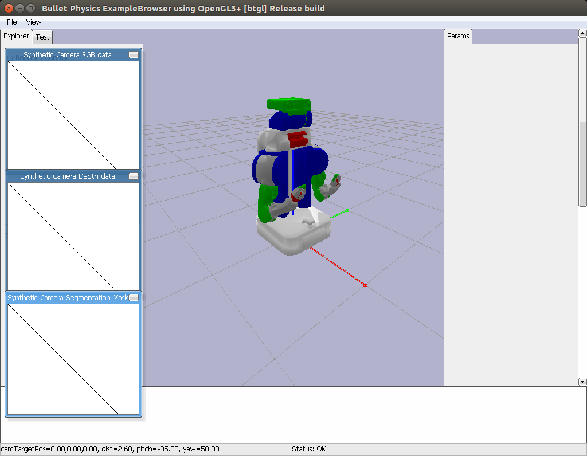

Interfaces
==========

Pybullet Interface
------------------

You can use a Pybullet interface using skrobot.

.. module:: skrobot.interfaces._pybullet

.. autosummary::
   :toctree: generated/
   :nosignatures:

   PybulletRobotInterface

>>> from skrobot.models import PR2
>>> from skrobot.interfaces import PybulletRobotInterface
>>> import pybullet
>>> client_id = pybullet.connect(pybullet.GUI)
>>> robot_model = PR2()
>>> interface = PybulletRobotInterface(robot_model, connect=client_id)
>>> interface.angle_vector(robot_model.reset_pose())

