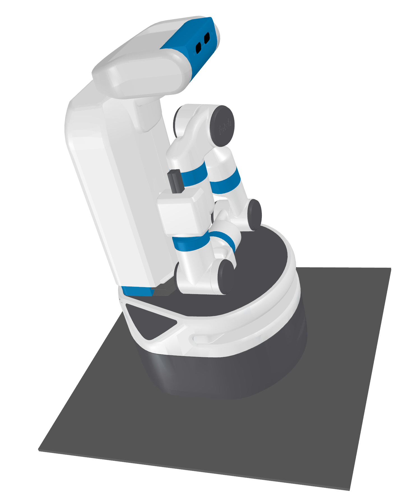
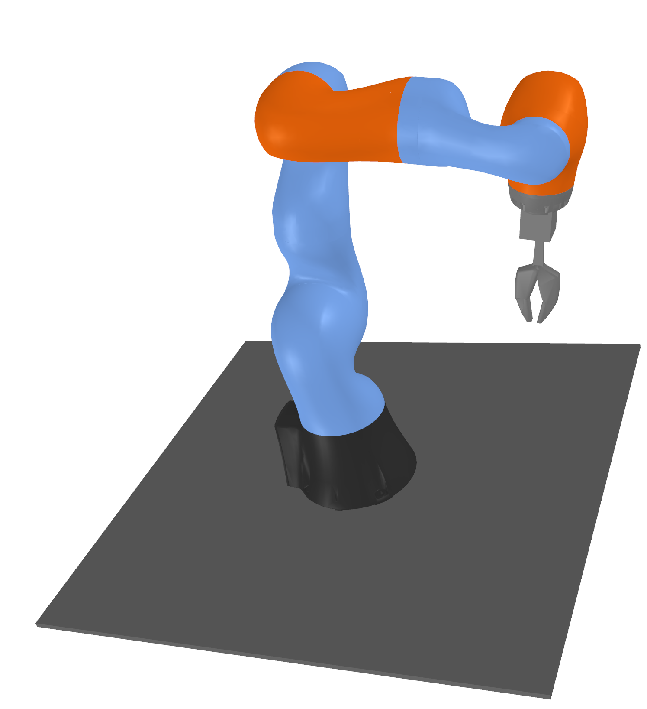

Models
======

Robot Model class
-----------------

.. module:: skrobot.model

.. autosummary::
   :toctree: generated/
   :nosignatures:

   RobotModel

Robot Model classes
-------------------

.. module:: skrobot.models

You can create use robot model classes. Here is a example of robot models.

Fetch
~~~~~

.. autosummary::
   :toctree: generated/
   :nosignatures:

   fetch.Fetch

Kuka
~~~~

.. autosummary::
   :toctree: generated/
   :nosignatures:

   kuka.Kuka

PR2
~~~

.. autosummary::
   :toctree: generated/
   :nosignatures:

   pr2.PR2

.. figure:: ../../image/pr2.png
    :scale: 40%
    :align: center
