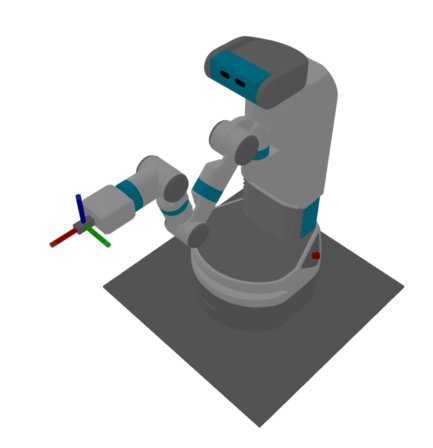
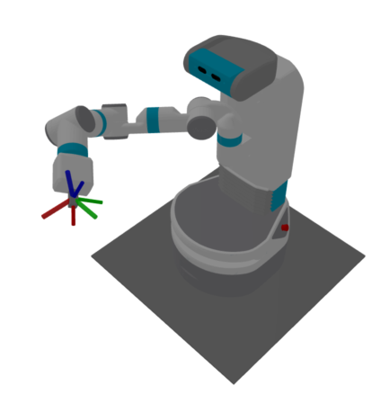
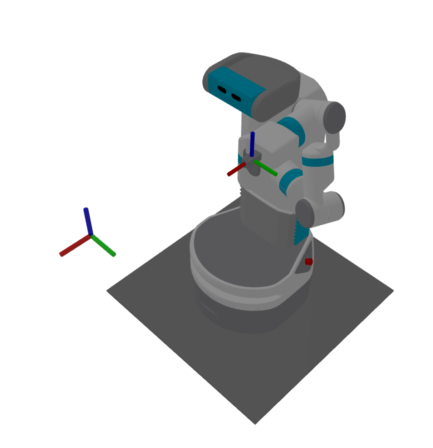
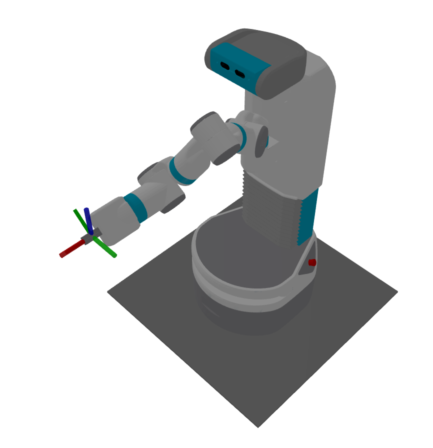
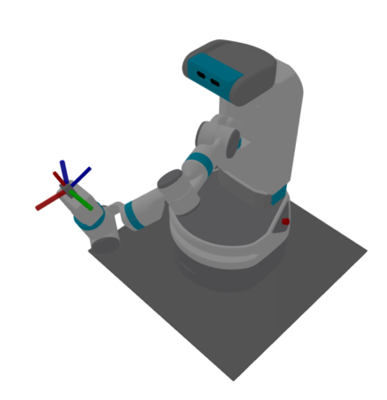
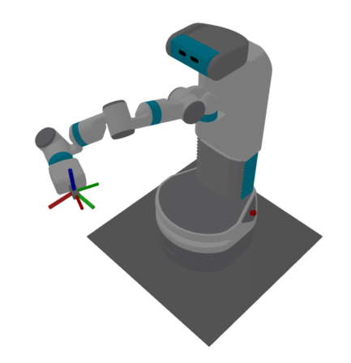
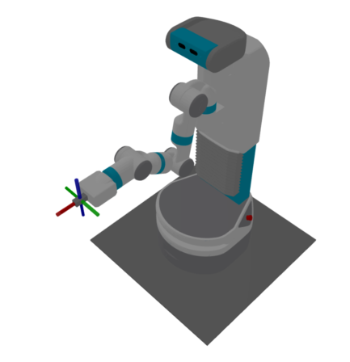
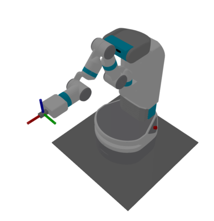
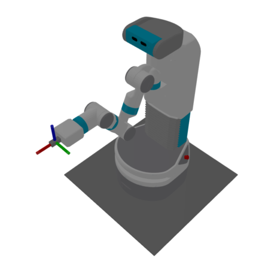

Robot Model Tips
================

Loading the Robot Model Without Mesh Data
-----------------------------------------

Sometimes, loading a robot model with full mesh data can be slow and resource-intensive. If mesh data is not necessary for your use case, you can improve the loading speed by disabling mesh data loading as shown below:

.. code-block:: python

    from datetime import datetime

    from skrobot.models import PR2
    from skrobot.utils.urdf import no_mesh_load_mode

    start = datetime.now()
    robot_no_mesh = PR2()
    end = datetime.now()
    print(end - start)
    # 0:00:00.269310

    # Load the PR2 model without mesh data for faster initialization
    start = datetime.now()
    with no_mesh_load_mode():
        robot_no_mesh = PR2()
    end = datetime.now()
    print(end - start)
    # 0:00:00.083222

This approach is useful when you only need the basic structure of the robot without the visual details of the mesh, which can be beneficial in scenarios where performance is prioritized over graphical fidelity.

Inverse Kinematics
------------------

Inverse kinematics (IK) is the process of calculating joint angles required to position the robot's end-effector at a desired pose in Cartesian space. Scikit-robot provides both single-pose and batch inverse kinematics solvers with comprehensive constraint support.

Basic Inverse Kinematics
~~~~~~~~~~~~~~~~~~~~~~~~~

The basic inverse kinematics solver finds joint angles to reach a target pose:

.. code-block:: python

    import numpy as np
    from skrobot.coordinates import Coordinates
    from skrobot.models import PR2

    # Initialize robot and set up target
    robot = PR2()
    robot.reset_pose()

    # Define target pose
    target_coords = Coordinates(
        pos=[0.8, -0.3, 0.8],
        rot=[0.0, np.deg2rad(30), np.deg2rad(-30)]
    )

    # Solve inverse kinematics
    link_list = robot.rarm.link_list
    result = robot.inverse_kinematics(
        target_coords,
        link_list=link_list,
        move_target=robot.rarm.end_coords,
        rotation_mask=True,
        position_mask=True,
        stop=100,              # Maximum iterations
        thre=0.001,           # Position threshold (meters)
        rthre=np.deg2rad(1.0) # Rotation threshold (radians)
    )

    if result is not False:
        print("IK solved successfully!")
        print("Joint angles:", robot.angle_vector())
    else:
        print("IK failed to converge")

Batch Inverse Kinematics
~~~~~~~~~~~~~~~~~~~~~~~~~

For multiple target poses, batch IK provides significant performance improvements:

.. code-block:: python

    from skrobot.coordinates import Coordinates
    from skrobot.models import Fetch

    robot = Fetch()
    robot.reset_pose()

    # Define multiple target poses
    target_poses = [
        Coordinates(pos=[0.7, -0.2, 0.9]).rotate(np.deg2rad(30), 'y'),
        Coordinates(pos=[0.6, -0.3, 1.0]).rotate(np.deg2rad(-25), 'z'),
        Coordinates(pos=[0.8, -0.1, 0.8]).rotate(np.deg2rad(45), 'x'),
    ]

    # Solve batch inverse kinematics
    link_list = robot.rarm.link_list
    solutions, success_flags, attempt_counts = robot.batch_inverse_kinematics(
        target_poses,
        link_list=link_list,
        move_target=robot.rarm.end_coords,
        rotation_mask=True,
        position_mask=True,
        stop=100,
        thre=0.001,
        rthre=np.deg2rad(1.0),
        attempts_per_pose=50  # Multiple attempts with random initial poses
    )

    # Check results
    for i, (solution, success, attempts) in enumerate(zip(solutions, success_flags, attempt_counts)):
        if success:
            print(f"Pose {i}: Solved in {attempts} attempts")
            robot.angle_vector(solution)  # Apply solution
        else:
            print(f"Pose {i}: Failed after {attempts} attempts")

Collision Model
~~~~~~~~~~~~~~~

Every robot carries a collision model, built the first time it is asked for
and reused (and persisted, so once per machine):

.. code-block:: python

    model = robot.collision_model
    print(model.describe())
    # 20 collision links, 167 self-collision pairs (method=fcl, derived now);
    # excluded 19 adjacent, 4 touching at the default pose, 0 always
    # colliding; the sphere/capsule proxies already overlap for 9 of the
    # checked pairs at the default pose

    robot.reset_pose()
    model.in_self_collision()       # False, on the exact meshes
    model.self_colliding_pairs()    # []

It holds two things every collision-aware routine needs: a sphere/capsule
proxy for each link that has a collision mesh, and the pairs of links worth
checking against each other. The pairs are derived the way MoveIt's setup
assistant fills in an SRDF -- parent/child pairs are dropped, so are pairs
already in contact at the default pose (parts that touch by design) and
pairs that collide in nearly every random configuration -- so a legitimate
rest pose no longer reads as "in collision" on robots like the PR2 whose
links overlap at rest. ``model.excluded`` lists what was dropped and why.

Two query surfaces come out of it. ``model.checker`` is a
``RobotCollisionChecker`` over the proxies: cheap and usable from a
differentiable cost, but conservative, since a proxy is fatter than its
mesh. ``model.proxy_overlap_pairs`` tells you how conservative for your
robot. ``model.in_self_collision()`` answers on the meshes instead and
needs the optional ``python-fcl`` package; without it the pair derivation
also falls back to the proxies and says so with a warning.

``robot.build_collision_model(...)`` rebuilds it with other settings, or
after you change a link's collision mesh.

Reading the Result
~~~~~~~~~~~~~~~~~~

``batch_inverse_kinematics`` returns a ``BatchIKResult``. It unpacks
exactly like the tuple it has always returned, so existing code is
unaffected, but the attributes are the better way to read it: they are
named the same whatever options the solve used, while the tuple positions
shift when ``use_base`` inserts the base poses.

.. code-block:: python

    result = robot.batch_inverse_kinematics(target_poses, link_list=link_list,
                                            move_target=robot.rarm.end_coords)

    result.solutions       # list of angle vectors
    result.success_flags   # list of bools
    result.base_poses      # None unless use_base was requested
    result.attempts        # every attempt the solve ran

Every Attempt
~~~~~~~~~~~~~

``attempts_per_pose`` solves each pose several times from different seeds
and keeps the best one per pose. The other attempts are computed all the
same, and on a redundant arm they are alternative configurations reaching
the same pose. ``result.attempts`` holds them -- there is nothing to
enable, and the arrays are built on first access:

.. code-block:: python

    attempts = robot.batch_inverse_kinematics(
        target_poses,
        link_list=link_list,
        move_target=robot.rarm.end_coords,
        attempts_per_pose=20,
    ).attempts

    attempts.angle_vectors   # (n_poses, attempts_per_pose, n_dof)
    attempts.success         # (n_poses, attempts_per_pose)
    attempts.errors          # (n_poses, attempts_per_pose)
    attempts.base_poses      # per-attempt base poses, with use_base

    for pose_index in range(len(target_poses)):
        reached = attempts.angle_vectors[pose_index][
            attempts.success[pose_index]]
        print("pose {}: {} attempts reached the target".format(
            pose_index, len(reached)))

Attempts are ordered by attempt index, not by quality, and failed attempts
are kept -- filter on ``attempts.success``. Attempt 0 is the one seeded
from the current angles when ``initial_angles='current'``.

Note that the successful attempts are **not** distinct configurations.
``attempts_per_pose`` is a retry mechanism seeded with random
perturbations, not a sampler that covers the solution manifold, so
different seeds routinely converge to the same configuration. In one
measurement on a Fetch arm, 50 attempts produced 25 successes but only 11
configurations that differed by more than 0.5 rad in any joint. Cluster
the results yourself if you need genuinely different postures:

.. code-block:: python

    representatives = []
    for q in attempts.angle_vectors[0][attempts.success[0]]:
        if not any(np.abs(q - r).max() < 0.5 for r in representatives):
            representatives.append(q)

Axis Constraints
~~~~~~~~~~~~~~~~

The ``position_mask`` and ``rotation_mask`` parameters provide fine-grained control over which degrees of freedom are constrained during IK solving. The mask specifies which axes to **constrain** (1=constrained, 0=free).

Position Mask Constraints
^^^^^^^^^^^^^^^^^^^^^^^^^

Controls which positional degrees of freedom are constrained:

.. code-block:: python

    # Full 3D position constraint (default)
    robot.inverse_kinematics(target, position_mask=True)

    # No position constraints - ignore position
    robot.inverse_kinematics(target, position_mask=False)

    # Constrain only specific axes
    robot.inverse_kinematics(target, position_mask='z')    # Only Z (height)
    robot.inverse_kinematics(target, position_mask='xy')   # Only X and Y (planar)
    robot.inverse_kinematics(target, position_mask='xz')   # X and Z only

**Supported position mask values:**

- ``True``: Constrain all position axes (X, Y, Z)
- ``False`` or ``None``: No position constraint
- ``'x'``, ``'y'``, ``'z'``: Constrain only the specified axis
- ``'xy'``, ``'yz'``, ``'xz'``: Constrain the two specified axes
- ``[1, 0, 1]``: Direct mask specification (constrain X and Z)

Rotation Mask Constraints
^^^^^^^^^^^^^^^^^^^^^^^^^

Controls which rotational degrees of freedom are constrained. The two-axis masks are most useful as they preserve one axis direction while allowing rotation around it.

.. code-block:: python

    # Full 3D rotation constraint (default)
    robot.inverse_kinematics(target, rotation_mask=True)

    # No rotation constraints - ignore orientation
    robot.inverse_kinematics(target, rotation_mask=False)

    # Two-axis constraints (recommended for partial rotation control)
    robot.inverse_kinematics(target, rotation_mask='yz')   # X-axis direction preserved
    robot.inverse_kinematics(target, rotation_mask='xz')   # Y-axis direction preserved
    robot.inverse_kinematics(target, rotation_mask='xy')   # Z-axis direction preserved

**Supported rotation mask values:**

- ``True``: Constrain all rotation axes (full orientation match)
- ``False`` or ``None``: No rotation constraint (orientation free)
- ``'xy'``, ``'yz'``, ``'xz'``: Constrain two rotation axes, preserving the third axis direction
- ``[1, 1, 0]``: Direct mask specification (same as ``'xy'``)

Mirror Mode (rotation_mirror)
^^^^^^^^^^^^^^^^^^^^^^^^^^^^^

The ``rotation_mirror`` parameter allows the solver to consider both positive and negative directions of a specific axis, choosing the orientation that results in the shortest rotation path:

.. code-block:: python

    # Allow X-axis to flip direction if closer
    robot.inverse_kinematics(target, rotation_mask=True, rotation_mirror='x')

    # Allow Y-axis to flip direction if closer
    robot.inverse_kinematics(target, rotation_mask=True, rotation_mirror='y')

    # Allow Z-axis to flip direction if closer
    robot.inverse_kinematics(target, rotation_mask=True, rotation_mirror='z')

Backwards Compatibility (Legacy API)
^^^^^^^^^^^^^^^^^^^^^^^^^^^^^^^^^^^^

The legacy ``rotation_axis`` and ``translation_axis`` parameters are still supported for backwards compatibility. They are automatically converted to the new mask format internally.

**Important semantic difference:**

- Legacy API specifies axes to **ignore** (free axes)
- New API specifies axes to **constrain** (fixed axes)

**Conversion table (rotation):**

.. list-table::
   :header-rows: 1
   :widths: 30 30 40

   * - Legacy (rotation_axis)
     - New (rotation_mask)
     - Effect
   * - ``True``
     - ``True``
     - Full rotation constraint
   * - ``False``
     - ``False``
     - No rotation constraint
   * - ``'x'`` (ignore X)
     - ``'yz'``
     - X-axis direction preserved
   * - ``'y'`` (ignore Y)
     - ``'xz'``
     - Y-axis direction preserved
   * - ``'z'`` (ignore Z)
     - ``'xy'``
     - Z-axis direction preserved

**Example:**

.. code-block:: python

    # These are equivalent - Y-axis direction preserved:
    robot.inverse_kinematics(target, rotation_axis='y')    # Legacy: ignore Y
    robot.inverse_kinematics(target, rotation_mask='xz')   # New: constrain X,Z

    # These are equivalent - Z-axis direction preserved:
    robot.inverse_kinematics(target, rotation_axis='z')    # Legacy: ignore Z
    robot.inverse_kinematics(target, rotation_mask='xy')   # New: constrain X,Y

Visual Examples of Axis Constraints
^^^^^^^^^^^^^^^^^^^^^^^^^^^^^^^^^^^

The following images demonstrate how different axis constraints affect the robot's inverse kinematics solutions using the Fetch robot.

**Basic Control Modes**

   **Full 6-DOF Control**

   ``rotation_mask=True, position_mask=True``

   **Position Only (No Orientation)**

   ``rotation_mask=False, position_mask=True``

   **Orientation Only (No Position)**

   ``rotation_mask=True, position_mask=False``

**Partial Rotation Constraints**

These examples show IK with one axis direction preserved by constraining two rotation components.

   **X-axis Direction Preserved**

   New: ``rotation_mask='yz'`` / Legacy: ``rotation_axis='x'``

   X-axis direction matches target, rotation around X is free.

   **Y-axis Direction Preserved**

   New: ``rotation_mask='xz'`` / Legacy: ``rotation_axis='y'``

   Y-axis direction matches target, rotation around Y is free.

   **Z-axis Direction Preserved**

   New: ``rotation_mask='xy'`` / Legacy: ``rotation_axis='z'``

   Z-axis direction matches target, rotation around Z is free.

**Mirror Notation (Axis Flip Optimization)**

The mirror notation allows the solver to consider both positive and negative directions of a specific axis, choosing the orientation that results in the shortest rotation path:

   **X-mirror (Optimized X-axis Orientation)**

   ``rotation_mask=True, rotation_mirror='x', position_mask=True``

   Considers both +X and -X directions, chooses nearest

   **Y-mirror (Optimized Y-axis Orientation)**

   ``rotation_mask=True, rotation_mirror='y', position_mask=True``

   Considers both +Y and -Y directions, chooses nearest

   **Z-mirror (Optimized Z-axis Orientation)**

   ``rotation_mask=True, rotation_mirror='z', position_mask=True``

   Considers both +Z and -Z directions, chooses nearest

Practical Examples with Constraints
^^^^^^^^^^^^^^^^^^^^^^^^^^^^^^^^^^^

.. code-block:: python

    from skrobot.coordinates import Coordinates
    from skrobot.models import Fetch

    # Initialize robot
    robot = Fetch()
    robot.reset_pose()

    # Define target pose
    target = Coordinates(pos=[0.7, 0.0, 1.0])

    # Setup link list and move target for all examples
    link_list = robot.rarm.link_list
    move_target = robot.rarm.end_coords

    # Position-only IK (ignore orientation)
    robot.inverse_kinematics(
        target,
        link_list=link_list,
        move_target=move_target,
        position_mask=True,
        rotation_mask=False
    )

    # Orientation-only IK (ignore position)
    robot.reset_pose()
    robot.inverse_kinematics(
        target,
        link_list=link_list,
        move_target=move_target,
        position_mask=False,
        rotation_mask=True
    )

    # Planar motion (XY plane) with roll/pitch control
    robot.reset_pose()
    robot.inverse_kinematics(
        target,
        link_list=link_list,
        move_target=move_target,
        position_mask='xy',
        rotation_mask='xy'
    )

    # Vertical motion with yaw control
    robot.reset_pose()
    robot.inverse_kinematics(
        target,
        link_list=link_list,
        move_target=move_target,
        position_mask='z',
        rotation_mask='z'
    )

Advanced Features
~~~~~~~~~~~~~~~~~

Multiple Attempts for Robust Solving
^^^^^^^^^^^^^^^^^^^^^^^^^^^^^^^^^^^^^

When using batch IK, you can specify multiple attempts per pose to improve success rates:

.. code-block:: python

    from skrobot.coordinates import Coordinates
    from skrobot.models import Fetch
    import numpy as np

    # Initialize robot
    robot = Fetch()
    robot.reset_pose()

    # Define multiple target poses
    target_poses = [
        Coordinates(pos=[0.7, 0.0, 1.0]),
        Coordinates(pos=[0.6, 0.2, 0.9]),
        Coordinates(pos=[0.8, -0.1, 1.1]),
    ]

    # Setup parameters
    link_list = robot.rarm.link_list
    move_target = robot.rarm.end_coords

    # Batch IK with multiple attempts
    solutions, success_flags, attempt_counts = robot.batch_inverse_kinematics(
        target_poses,
        link_list=link_list,
        move_target=move_target,
        attempts_per_pose=50,           # Try up to 50 different initial poses
    )

Custom Convergence Thresholds
^^^^^^^^^^^^^^^^^^^^^^^^^^^^^^

Adjust precision requirements based on your application:

.. code-block:: python

    from skrobot.coordinates import Coordinates
    from skrobot.models import Fetch
    import numpy as np

    # Initialize robot
    robot = Fetch()
    robot.reset_pose()

    # Define target pose
    target = Coordinates(pos=[0.7, 0.0, 1.0])

    # Setup parameters
    link_list = robot.rarm.link_list
    move_target = robot.rarm.end_coords

    # High precision for precise manipulation
    robot.inverse_kinematics(
        target,
        link_list=link_list,
        move_target=move_target,
        thre=0.0001,           # 0.1mm position tolerance
        rthre=np.deg2rad(0.1)  # 0.1 degree rotation tolerance
    )

    # Lower precision for faster solving
    robot.reset_pose()
    robot.inverse_kinematics(
        target,
        link_list=link_list,
        move_target=move_target,
        thre=0.01,             # 1cm position tolerance
        rthre=np.deg2rad(5.0)  # 5 degree rotation tolerance
    )

Performance Considerations
~~~~~~~~~~~~~~~~~~~~~~~~~~

1. **Batch vs Sequential**: Use ``batch_inverse_kinematics`` for multiple poses - it's significantly faster than calling ``inverse_kinematics`` in a loop.

2. **Constraint Selection**: More constraints generally lead to faster convergence. If you don't need full 6-DOF control, specify appropriate axis constraints.

3. **Initial Poses**: For difficult IK problems, use multiple attempts with ``attempts_per_pose`` > 1.

4. **Iteration Limits**: Adjust ``stop`` parameter based on complexity - simple poses may solve in 10-20 iterations, while complex poses may need 100+.

Common Patterns
~~~~~~~~~~~~~~~

.. code-block:: python

    from skrobot.coordinates import Coordinates
    from skrobot.models import Fetch
    import numpy as np

    # Initialize robot
    robot = Fetch()
    robot.reset_pose()

    # Setup parameters
    link_list = robot.rarm.link_list
    move_target = robot.rarm.end_coords

    # Pick and place operations - position with yaw control
    pick_poses = [
        Coordinates(pos=[0.5, 0.2, 0.8]),
        Coordinates(pos=[0.6, 0.1, 0.7]),
    ]

    solutions, success_flags, attempt_counts = robot.batch_inverse_kinematics(
        pick_poses,
        link_list=link_list,
        move_target=move_target,
        position_mask=True,
        rotation_mask='z',  # Only control yaw for grasping
        attempts_per_pose=20
    )

    # Painting/welding - orientation-critical operations
    paint_poses = [
        Coordinates(pos=[0.5, 0.0, 0.8], rot=[0, np.pi/2, 0]),
        Coordinates(pos=[0.6, 0.0, 0.8], rot=[0, np.pi/2, 0]),
    ]

    solutions, success_flags, attempt_counts = robot.batch_inverse_kinematics(
        paint_poses,
        link_list=link_list,
        move_target=move_target,
        position_mask=True,
        rotation_mask=True,  # Full orientation control
        thre=0.001,          # High precision
        rthre=np.deg2rad(1.0),
        attempts_per_pose=20
    )
