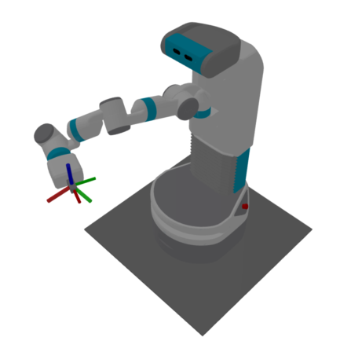
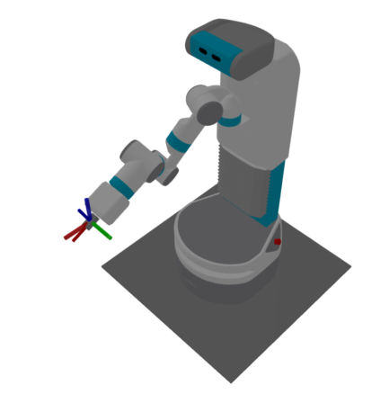
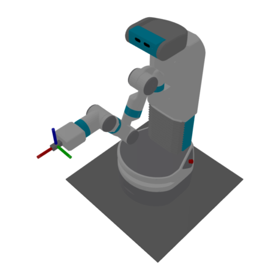

Robot Model Tips
================

Loading the Robot Model Without Mesh Data
-----------------------------------------

Sometimes, loading a robot model with full mesh data can be slow and resource-intensive. If mesh data is not necessary for your use case, you can improve the loading speed by disabling mesh data loading as shown below:

.. code-block:: python

    from datetime import datetime

    from skrobot.models import PR2
    from skrobot.utils.urdf import no_mesh_load_mode

    start = datetime.now()
    robot_no_mesh = PR2()
    end = datetime.now()
    print(end - start)
    # 0:00:00.269310

    # Load the PR2 model without mesh data for faster initialization
    start = datetime.now()
    with no_mesh_load_mode():
        robot_no_mesh = PR2()
    end = datetime.now()
    print(end - start)
    # 0:00:00.083222

This approach is useful when you only need the basic structure of the robot without the visual details of the mesh, which can be beneficial in scenarios where performance is prioritized over graphical fidelity.

Inverse Kinematics
------------------

Inverse kinematics (IK) is the process of calculating joint angles required to position the robot's end-effector at a desired pose in Cartesian space. Scikit-robot provides both single-pose and batch inverse kinematics solvers with comprehensive constraint support.

Basic Inverse Kinematics
~~~~~~~~~~~~~~~~~~~~~~~~~

The basic inverse kinematics solver finds joint angles to reach a target pose:

.. code-block:: python

    import numpy as np
    from skrobot.coordinates import Coordinates
    from skrobot.models import PR2

    # Initialize robot and set up target
    robot = PR2()
    robot.reset_pose()
    
    # Define target pose
    target_coords = Coordinates(
        pos=[0.8, -0.3, 0.8],
        rot=[0.0, np.deg2rad(30), np.deg2rad(-30)]
    )
    
    # Solve inverse kinematics
    link_list = robot.rarm.link_list
    result = robot.inverse_kinematics(
        target_coords,
        link_list=link_list,
        move_target=robot.rarm.end_coords,
        rotation_axis=True,
        translation_axis=True,
        stop=100,              # Maximum iterations
        thre=0.001,           # Position threshold (meters)
        rthre=np.deg2rad(1.0) # Rotation threshold (radians)
    )
    
    if result is not False:
        print("IK solved successfully!")
        print("Joint angles:", robot.angle_vector())
    else:
        print("IK failed to converge")

Batch Inverse Kinematics
~~~~~~~~~~~~~~~~~~~~~~~~~

For multiple target poses, batch IK provides significant performance improvements:

.. code-block:: python

    from skrobot.coordinates import Coordinates
    from skrobot.models import Fetch

    robot = Fetch()
    robot.reset_pose()
    
    # Define multiple target poses
    target_poses = [
        Coordinates(pos=[0.7, -0.2, 0.9]).rotate(np.deg2rad(30), 'y'),
        Coordinates(pos=[0.6, -0.3, 1.0]).rotate(np.deg2rad(-25), 'z'),
        Coordinates(pos=[0.8, -0.1, 0.8]).rotate(np.deg2rad(45), 'x'),
    ]
    
    # Solve batch inverse kinematics
    link_list = robot.rarm.link_list
    solutions, success_flags, attempt_counts = robot.batch_inverse_kinematics(
        target_poses,
        link_list=link_list,
        move_target=robot.rarm.end_coords,
        rotation_axis=True,
        translation_axis=True,
        stop=100,
        thre=0.001,
        rthre=np.deg2rad(1.0),
        attempts_per_pose=50  # Multiple attempts with random initial poses
    )
    
    # Check results
    for i, (solution, success, attempts) in enumerate(zip(solutions, success_flags, attempt_counts)):
        if success:
            print(f"Pose {i}: Solved in {attempts} attempts")
            robot.angle_vector(solution)  # Apply solution
        else:
            print(f"Pose {i}: Failed after {attempts} attempts")

Axis Constraints
~~~~~~~~~~~~~~~~

The ``rotation_axis`` and ``translation_axis`` parameters provide fine-grained control over which degrees of freedom are constrained during IK solving.

Translation Axis Constraints
^^^^^^^^^^^^^^^^^^^^^^^^^^^^

Controls which translational degrees of freedom are used:

.. code-block:: python

    # Full 3D translation (default)
    robot.inverse_kinematics(target, translation_axis=True)
    
    # No translation constraints - ignore position
    robot.inverse_kinematics(target, translation_axis=False)
    
    # Constrain only specific axes
    robot.inverse_kinematics(target, translation_axis='xy')  # Only X and Y
    robot.inverse_kinematics(target, translation_axis='z')   # Only Z
    robot.inverse_kinematics(target, translation_axis='xz')  # X and Z only

**Supported translation axis values:**

- ``True``: Use all translation axes (X, Y, Z)
- ``False`` or ``None``: Ignore translation completely
- ``'x'``, ``'y'``, ``'z'``: Constrain only the specified axis
- ``'xy'``, ``'yz'``, ``'xz'``: Constrain two specified axes
- ``'xm'``, ``'ym'``, ``'zm'``: Mirror notation - finds nearest axis orientation by allowing sign flip (e.g., ``'xm'`` allows X-axis to point in opposite direction if closer)

Rotation Axis Constraints
^^^^^^^^^^^^^^^^^^^^^^^^^

Controls which rotational degrees of freedom are used:

.. code-block:: python

    # Full 3D rotation (default)
    robot.inverse_kinematics(target, rotation_axis=True)
    
    # No rotation constraints - ignore orientation
    robot.inverse_kinematics(target, rotation_axis=False)
    
    # Constrain only specific rotation axes
    robot.inverse_kinematics(target, rotation_axis='z')     # Only yaw
    robot.inverse_kinematics(target, rotation_axis='xy')    # Roll and pitch only
    robot.inverse_kinematics(target, rotation_axis=True)   # All rotations

**Supported rotation axis values:**

- ``True``: Use all rotation axes (roll, pitch, yaw)
- ``False`` or ``None``: Ignore rotation completely  
- ``'x'``, ``'y'``, ``'z'``: Constrain only the specified rotation axis
- ``'xy'``, ``'yz'``, ``'xz'``: Constrain two specified rotation axes
- ``'xm'``, ``'ym'``, ``'zm'``: Mirror notation - finds nearest orientation by allowing axis sign flip (e.g., ``'xm'`` optimizes rotation considering both +X and -X directions)

Visual Examples of Axis Constraints
^^^^^^^^^^^^^^^^^^^^^^^^^^^^^^^^^^^

The following images demonstrate how different axis constraints affect the robot's inverse kinematics solutions using the Fetch robot.

**Basic Control Modes**

   
   **Full 6-DOF Control**
   
   ``rotation_axis=True, translation_axis=True``

   
   **Position Only (No Orientation)**
   
   ``rotation_axis=False, translation_axis=True``

   
   **Orientation Only (No Position)**
   
   ``rotation_axis=True, translation_axis=False``

**Single Axis Rotation with Full Translation**

   
   **Roll Only (X-axis Rotation)**
   
   ``rotation_axis='x', translation_axis=True``

   
   **Pitch Only (Y-axis Rotation)**
   
   ``rotation_axis='y', translation_axis=True``

   
   **Yaw Only (Z-axis Rotation)**
   
   ``rotation_axis='z', translation_axis=True``

**Double Axis Rotation with Full Translation**

   
   **Roll + Pitch (XY-axes Rotation)**
   
   ``rotation_axis='xy', translation_axis=True``

   
   **Pitch + Yaw (YZ-axes Rotation)**
   
   ``rotation_axis='yz', translation_axis=True``

   
   **Yaw + Roll (ZX-axes Rotation)**
   
   ``rotation_axis='zx', translation_axis=True``

**Mirror Notation (Axis Flip Optimization)**

The mirror notation allows the solver to consider both positive and negative directions of a specific axis, choosing the orientation that results in the shortest rotation path:

   
   **X-mirror (Optimized X-axis Orientation)**
   
   ``rotation_axis='xm', translation_axis=True``
   
   Considers both +X and -X directions, chooses nearest

   
   **Y-mirror (Optimized Y-axis Orientation)**
   
   ``rotation_axis='ym', translation_axis=True``
   
   Considers both +Y and -Y directions, chooses nearest

   
   **Z-mirror (Optimized Z-axis Orientation)**
   
   ``rotation_axis='zm', translation_axis=True``
   
   Considers both +Z and -Z directions, chooses nearest

**Mixed Constraints**

Common combinations of translation and rotation constraints for specific applications:

.. figure:: ../_static/ik_mixed_planar_yaw.png
   :width: 60%
   :align: center
   
   **Planar Motion + Yaw Control**
   
   ``rotation_axis='z', translation_axis='xy'``
   
   Useful for mobile robots on flat surfaces

   
   **Vertical Motion + Tilt Control**
   
   ``rotation_axis='xy', translation_axis='z'``
   
   Useful for lifting with orientation adjustment

   
   **Frontal Plane Motion**
   
   ``rotation_axis='x', translation_axis='yz'``
   
   Constrains motion to YZ plane with roll control

Practical Examples with Constraints
^^^^^^^^^^^^^^^^^^^^^^^^^^^^^^^^^^^

.. code-block:: python

    from skrobot.coordinates import Coordinates
    from skrobot.models import Fetch
    
    # Initialize robot
    robot = Fetch()
    robot.reset_pose()
    
    # Define target pose
    target = Coordinates(pos=[0.7, 0.0, 1.0])
    
    # Setup link list and move target for all examples
    link_list = robot.rarm.link_list
    move_target = robot.rarm.end_coords
    
    # Position-only IK (ignore orientation)
    robot.inverse_kinematics(
        target,
        link_list=link_list,
        move_target=move_target,
        translation_axis=True,
        rotation_axis=False
    )
    
    # Orientation-only IK (ignore position)
    robot.reset_pose()
    robot.inverse_kinematics(
        target,
        link_list=link_list,
        move_target=move_target,
        translation_axis=False,
        rotation_axis=True
    )
    
    # Planar motion (XY plane, limited rotation)
    robot.reset_pose()
    robot.inverse_kinematics(
        target,
        link_list=link_list,
        move_target=move_target,
        translation_axis='xy',
        rotation_axis='xy'
    )
    
    # Vertical motion with yaw control
    robot.reset_pose()
    robot.inverse_kinematics(
        target,
        link_list=link_list,
        move_target=move_target,
        translation_axis='z',
        rotation_axis='z'
    )

Advanced Features
~~~~~~~~~~~~~~~~~

Multiple Attempts for Robust Solving
^^^^^^^^^^^^^^^^^^^^^^^^^^^^^^^^^^^^^

When using batch IK, you can specify multiple attempts per pose to improve success rates:

.. code-block:: python

    from skrobot.coordinates import Coordinates
    from skrobot.models import Fetch
    import numpy as np
    
    # Initialize robot
    robot = Fetch()
    robot.reset_pose()
    
    # Define multiple target poses
    target_poses = [
        Coordinates(pos=[0.7, 0.0, 1.0]),
        Coordinates(pos=[0.6, 0.2, 0.9]),
        Coordinates(pos=[0.8, -0.1, 1.1]),
    ]
    
    # Setup parameters
    link_list = robot.rarm.link_list
    move_target = robot.rarm.end_coords
    
    # Batch IK with multiple attempts
    solutions, success_flags, attempt_counts = robot.batch_inverse_kinematics(
        target_poses,
        link_list=link_list,
        move_target=move_target,
        attempts_per_pose=50,           # Try up to 50 different initial poses
    )

Custom Convergence Thresholds
^^^^^^^^^^^^^^^^^^^^^^^^^^^^^^

Adjust precision requirements based on your application:

.. code-block:: python

    from skrobot.coordinates import Coordinates
    from skrobot.models import Fetch
    import numpy as np
    
    # Initialize robot
    robot = Fetch()
    robot.reset_pose()
    
    # Define target pose
    target = Coordinates(pos=[0.7, 0.0, 1.0])
    
    # Setup parameters
    link_list = robot.rarm.link_list
    move_target = robot.rarm.end_coords
    
    # High precision for precise manipulation
    robot.inverse_kinematics(
        target,
        link_list=link_list,
        move_target=move_target,
        thre=0.0001,           # 0.1mm position tolerance
        rthre=np.deg2rad(0.1)  # 0.1 degree rotation tolerance
    )
    
    # Lower precision for faster solving
    robot.reset_pose()
    robot.inverse_kinematics(
        target,
        link_list=link_list,
        move_target=move_target,
        thre=0.01,             # 1cm position tolerance
        rthre=np.deg2rad(5.0)  # 5 degree rotation tolerance
    )

Performance Considerations
~~~~~~~~~~~~~~~~~~~~~~~~~~

1. **Batch vs Sequential**: Use ``batch_inverse_kinematics`` for multiple poses - it's significantly faster than calling ``inverse_kinematics`` in a loop.

2. **Constraint Selection**: More constraints generally lead to faster convergence. If you don't need full 6-DOF control, specify appropriate axis constraints.

3. **Initial Poses**: For difficult IK problems, use multiple attempts with ``attempts_per_pose`` > 1.

4. **Iteration Limits**: Adjust ``stop`` parameter based on complexity - simple poses may solve in 10-20 iterations, while complex poses may need 100+.

Common Patterns
~~~~~~~~~~~~~~~

.. code-block:: python

    from skrobot.coordinates import Coordinates
    from skrobot.models import Fetch
    import numpy as np
    
    # Initialize robot
    robot = Fetch()
    robot.reset_pose()
    
    # Setup parameters
    link_list = robot.rarm.link_list
    move_target = robot.rarm.end_coords
    
    # Pick and place operations - position-only approach
    pick_poses = [
        Coordinates(pos=[0.5, 0.2, 0.8]),
        Coordinates(pos=[0.6, 0.1, 0.7]),
    ]
    
    solutions, success_flags, attempt_counts = robot.batch_inverse_kinematics(
        pick_poses,
        link_list=link_list,
        move_target=move_target,
        translation_axis=True,
        rotation_axis='z',  # Only control yaw for grasping
        attempts_per_pose=20
    )
    
    # Painting/welding - orientation-critical operations
    paint_poses = [
        Coordinates(pos=[0.5, 0.0, 0.8], rot=[0, np.pi/2, 0]),
        Coordinates(pos=[0.6, 0.0, 0.8], rot=[0, np.pi/2, 0]),
    ]
    
    solutions, success_flags, attempt_counts = robot.batch_inverse_kinematics(
        paint_poses,
        link_list=link_list,
        move_target=move_target,
        translation_axis=True,
        rotation_axis=True,  # Full orientation control
        thre=0.001,          # High precision
        rthre=np.deg2rad(1.0),
        attempts_per_pose=20
    )
