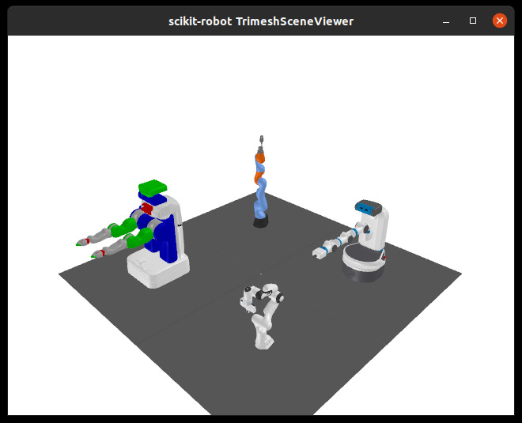
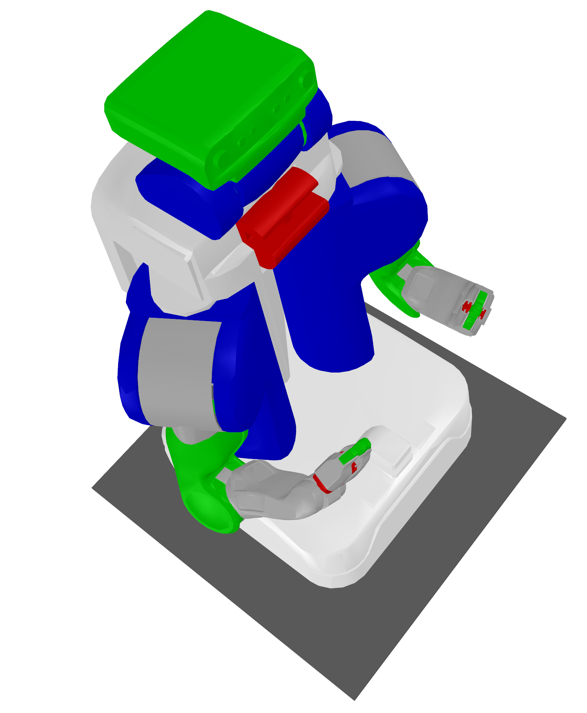
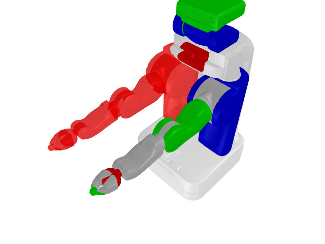
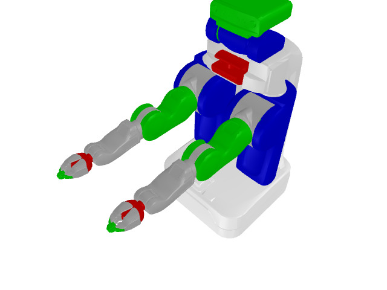

Viewers
=======

Examples
========

You can easily try out visualization programs using the examples found in `scikit-robot/examples <https://github.com/iory/scikit-robot/tree/main/examples>`_

.. code-block:: bash

    python robot_models.py --viewer trimesh

CommandLine Tools
=================

You can easily visualize a URDF by providing it as an argument to the visualize-urdf command.

.. code-block:: bash

    visualize-urdf ~/.skrobot/pr2_description/pr2.urdf

Viewer classes
==============

TrimeshSceneViewer
------------------

**Description:**
  The ``TrimeshSceneViewer`` is an extension of the ``trimesh.viewer.SceneViewer`` tailored for visualizing 3D scenes using the Trimesh library. It is specifically designed for 3D triangle meshes visualization and manipulation in robotic applications.

**Key Functionalities:**

- **Initialization and Configuration:**
  Initializes with options for screen resolution and an update interval. It sets up a scene using Trimesh to manage various geometrical entities.

- **Rendering Control:**
  Manages redraws upon user interactions such as mouse clicks, drags, scrolls, and key presses. It also handles window resizing events to ensure the scene is accurately rendered.

- **Scene Management:**
  Supports dynamic addition and deletion of geometrical entities. It allows management of links and their associated meshes, enabling real-time updates based on robotic movements.

- **Camera Management:**
  Facilitates camera positioning and orientation, allowing for customizable views based on specified angles and transformations reflective of the robotic link configurations.

PyrenderViewer
--------------

**Description:**
  The ``PyrenderViewer`` utilizes the Pyrender library for advanced 3D rendering, ideal for creating realistic visual simulations. This viewer is implemented as a Singleton to ensure only one instance exists throughout the program. It's particularly suited for complex rendering tasks in robotics, including detailed lighting, shading effects, and collision visualization.

**Key Functionalities:**

- **Initialization and Configuration:**
  The viewer is initialized with specified resolution, update interval, and rendering flags. Key parameters include:

  - ``resolution``: Window size (default: ``(640, 480)``)
  - ``update_interval``: Update frequency in seconds (default: ``1 / 30``, i.e. 30 Hz)
  - ``enable_collision_toggle``: Enable collision/visual mesh switching (default: ``True``)
  - ``title``: Window title (default: ``'scikit-robot PyrenderViewer'``)

- **Rendering Control:**
  Handles real-time scene updates triggered by user interactions. The viewer automatically manages OpenGL compatibility with fallback support from OpenGL 4.1 → 4.0 → 3.3, ensuring robust operation across different systems including WSL2.

- **Scene Management:**
  Supports dynamic addition and removal of visual and collision meshes linked to robotic models. The viewer maintains real-time synchronization with robot configurations through the ``redraw()`` method.

- **Camera Management:**
  Offers detailed camera setup options through the ``set_camera()`` method:

  - Angle-based positioning with Euler angles
  - Distance and center point configuration
  - Field of view (FOV) adjustment
  - Direct Coordinates object support for precise camera placement

- **Collision/Visual Mesh Toggle:**
  When ``enable_collision_toggle=True``, press the ``v`` key to switch between:

  - **Visual meshes**: Default appearance meshes for rendering (left in figure below)
  - **Collision meshes**: Simplified meshes used for collision detection (displayed in orange/transparent, right in figure below)

  .. figure:: ../_static/visual-collision-comparison.jpg
     :width: 100%
     :align: center
     :alt: Visual mesh (left) vs Collision mesh (right) comparison

     **Visual mesh (left) vs Collision mesh (right).** The visual mesh shows the detailed appearance of the robot with textured wheels. The collision mesh on the right uses simplified cylinder representations for the wheels, which are computationally more efficient for collision detection algorithms.

- **360-Degree Image Capture:**
  The ``capture_360_images()`` method enables automated scene capture from multiple angles:

  - Configurable number of frames and camera elevation
  - Automatic GIF animation generation
  - Transparent background support
  - Custom lighting configuration options

**Keyboard Controls:**

The PyrenderViewer provides extensive keyboard controls for interactive manipulation:

.. list-table:: Keyboard Controls
   :header-rows: 1
   :widths: 10 90

   * - Key
     - Function
   * - ``a``
     - Toggle rotational animation mode
   * - ``c``
     - Toggle backface culling
   * - ``f``
     - Toggle fullscreen mode
   * - ``h``
     - Toggle shadow rendering (may impact performance)
   * - ``i``
     - Cycle through axis display modes (none → world → mesh → all)
   * - ``j``
     - **Toggle joint axes display** (shows/hides joint positions and axes for all robots)
   * - ``l``
     - Cycle lighting modes (scene → Raymond → direct)
   * - ``m``
     - Toggle face normal visualization
   * - ``n``
     - Toggle vertex normal visualization
   * - ``o``
     - Toggle orthographic camera mode
   * - ``q``
     - Quit the viewer
   * - ``r``
     - Start/stop GIF recording (opens file dialog on stop)
   * - ``s``
     - Save current view as image (opens file dialog)
   * - ``v``
     - **Toggle between visual and collision meshes** (if enabled)
   * - ``w``
     - Cycle wireframe modes
   * - ``z``
     - Reset camera to default view

**Mouse Controls:**

- **Left-click + drag**: Rotate camera around scene center
- **Ctrl + Left-click + drag**: Rotate camera around viewing axis
- **Shift + Left-click + drag** or **Middle-click + drag**: Pan camera
- **Right-click + drag** or **Scroll wheel**: Zoom in/out

**Example Usage:**

Basic viewer initialization and robot display:

.. code-block:: python

    from skrobot.viewers import PyrenderViewer
    from skrobot.models import PR2

    # Create viewer instance (Singleton pattern ensures only one instance)
    viewer = PyrenderViewer(resolution=(800, 600), update_interval=1.0/30)
    
    # Load and add robot model
    robot = PR2()
    viewer.add(robot)
    
    # Show the viewer window
    viewer.show()
    
    # Update robot pose and redraw
    robot.reset_manip_pose()
    viewer.redraw()

Collision/Visual mesh toggle example:

.. code-block:: python

    # Enable collision toggle functionality
    viewer = PyrenderViewer(enable_collision_toggle=True)
    
    # Add robot to viewer
    viewer.add(robot)
    viewer.show()
    
    # Press 'v' key in the viewer to toggle between visual and collision meshes
    # Collision meshes will appear in orange/transparent color
    
    # The visual mesh displays the full detailed geometry with textures
    # while collision mesh shows simplified shapes (e.g., cylinders for wheels)
    # optimized for physics calculations

360-degree image capture example:

.. code-block:: python

    # Capture 360-degree rotation images
    viewer.capture_360_images(
        output_dir="./robot_360",
        num_frames=36,  # One image every 10 degrees
        camera_elevation=45,  # Camera elevation angle
        create_gif=True,  # Generate animated GIF
        gif_duration=100,  # 100ms between frames
        transparent_background=True  # Render with transparent background
    )

ViserViewer
-----------

**Description:**
  The ``ViserViewer`` is a web-based 3D viewer built on the `Viser <https://viser.studio/>`_ library. It provides an interactive browser interface with GUI controls for manipulating robot joint angles and real-time inverse kinematics (IK).

**Key Functionalities:**

- **Web-based Interface:**
  Opens in your web browser, allowing remote access and cross-platform compatibility without requiring native window dependencies.

- **Interactive Joint Control:**
  Provides GUI sliders for each robot joint, organized by joint groups. Adjusting a slider immediately updates the robot visualization in real-time.

- **Interactive Inverse Kinematics:**
  When ``enable_ik=True``, the viewer automatically detects end-effectors (arms, head, etc.) and adds transform controls at each end-effector position. Dragging these controls solves IK in real-time, updating both the robot pose and joint sliders.

.. figure:: ../../image/viser-viewer.jpg
    :scale: 80%
    :align: center

    Viser viewer with joint angle sliders

**Interactive IK Demo:**

The following video demonstrates the interactive IK feature, where dragging the transform controls at each end-effector solves inverse kinematics in real-time:

.. raw:: html

   <video width="100%" controls>
     <source src="../../image/viser-interactive-ik.mp4" type="video/mp4">
     Your browser does not support the video tag.
   </video>

**Example Usage:**

.. code-block:: python

    from skrobot.viewers import ViserViewer
    from skrobot.models import Panda

    # Create viewer with interactive IK enabled
    viewer = ViserViewer(enable_ik=True)

    # Load and add robot model
    robot = Panda()
    viewer.add(robot)

    # Position the camera. ViserViewer implements the same set_camera API as
    # the trimesh / pyrender viewers, so the call is identical across backends.
    import numpy as np
    viewer.set_camera([0, 0, np.pi / 2.0])

    # Open browser to view
    viewer.show()

    # Block until the browser tab / window is closed
    viewer.wait_until_close()

**Command Line Usage:**

.. code-block:: bash

    # Use viser viewer with visualize-urdf command (IK is enabled by default)
    skr visualize-urdf ~/.skrobot/pr2_description/pr2.urdf --viewer viser

.. note::

  Both **TrimeshSceneViewer** and **PyrenderViewer** update at 30 Hz by default (``update_interval=1/30``). The viewer only re-renders when the scene actually changes (e.g. after :func:`redraw`), so a static view stays cheap even at 30 Hz. The ``update_interval`` controls how often the ``redraw()`` request is polled: a smaller value gives a higher refresh rate (smoother interaction and animation) at the cost of more idle CPU, while a larger value lowers idle CPU usage.

  Example usage:

  .. code-block:: python

    # 30 Hz is already the default; pass update_interval only to override it.
    viewer = skrobot.viewers.TrimeshSceneViewer(resolution=(640, 480), update_interval=1.0/30)   # 30 Hz (default)
    viewer = skrobot.viewers.PyrenderViewer(resolution=(640, 480), update_interval=1.0)           # 1 Hz, lower idle CPU

Selecting a viewer
==================

Use :func:`skrobot.viewers.create_viewer` to pick a backend by name instead of
importing a specific class. This is convenient for example scripts and
applications that expose a ``--viewer`` option:

.. code-block:: python

    import skrobot

    # name is one of 'trimesh', 'pyrender', 'viser' or 'notebook'
    viewer = skrobot.viewers.create_viewer('pyrender', resolution=(640, 480))
    viewer.add(skrobot.models.PR2())
    viewer.show()

Keyword arguments are forwarded to the selected viewer's constructor. Options a
backend does not accept are ignored, so the same call works across backends
(for example ``resolution`` applies to the trimesh / pyrender viewers but is
dropped for ``viser``, which serves over a browser, while ``enable_ik`` applies
only to ``viser``). An unknown name raises ``ValueError``.

Interactive helpers
===================

Every interactive viewer (``TrimeshSceneViewer``, ``PyrenderViewer`` and
``ViserViewer``) shares two convenience methods.

**wait_until_close()**
  Block until the viewer window is closed, pumping :func:`redraw` while
  waiting. It replaces the boilerplate
  ``while viewer.is_active: time.sleep(...); viewer.redraw()`` loop:

  .. code-block:: python

      viewer.show()
      viewer.wait_until_close()   # returns once the window / tab is closed

**pause(duration, fps=30.0)**
  Pause for ``duration`` seconds **while keeping the window interactive**. Use
  it in place of ``time.sleep(duration)`` inside animation loops. On macOS the
  trimesh and pyrender viewers run their GL event loop on the main thread, so a
  bare ``time.sleep`` freezes the window (the camera cannot be dragged) for the
  whole pause because no events are dispatched. ``pause`` instead pumps
  :func:`redraw` at ``fps`` (default 30 Hz) for the entire duration, so the view
  stays responsive. On backends that already render in a separate thread
  (trimesh / pyrender on Linux) or process (viser) the extra redraws are
  harmless.

  .. code-block:: python

      for av in trajectory:
          robot.angle_vector(av)
          viewer.pause(1.0)   # show this pose for 1 s; camera stays draggable

Color Management
----------------

**Changing Colors:**

To enhance the visibility and distinction of different components in a robot model, users can change the colors of individual links or the entire robot. This can be done using the ``set_color`` method, which applies a specified RGBA color to the link. The ``reset_color`` method restores the original color of the link, allowing for easy toggling between custom and default visualizations.

.. code-block:: python

    import time
    from skrobot.viewers import TrimeshSceneViewer
    from skrobot.models import PR2
    import numpy as np

    viewer = TrimeshSceneViewer()
    robot_model = PR2()
    viewer.add(robot_model)
    viewer.show()

    # Setting the color to red with some transparency
    color = [255, 0, 0, 200]
    for link in robot_model.find_link_path(robot_model.rarm_root_link, robot_model.r_gripper_l_finger_tip_link) + robot_model.find_link_path(robot_model.rarm_root_link, robot_model.r_gripper_r_finger_tip_link):
        link.set_color(color)

.. code-block:: python

    # Resetting the color to default
    for link in robot_model.find_link_path(robot_model.rarm_root_link, robot_model.r_gripper_l_finger_tip_link) + robot_model.find_link_path(robot_model.rarm_root_link, robot_model.r_gripper_r_finger_tip_link):
        link.reset_color()

