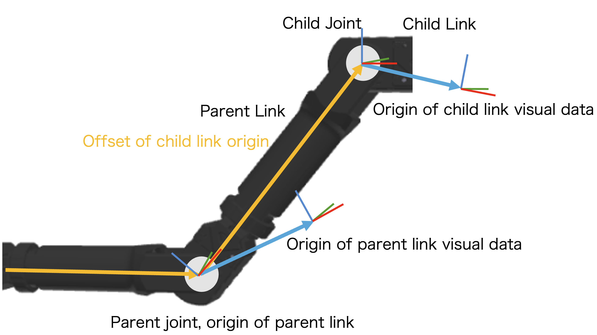

==================
URDF Manipulation
==================

This tutorial covers how to work with URDF (Unified Robot Description Format) files in scikit-robot.

Understanding URDF Structure
============================

URDF defines a robot as a tree structure of links connected by joints. The following diagram illustrates the relationship between links, joints, and visual origins:

Key concepts:

- **Link**: A rigid body with visual and collision geometry
- **Joint**: Connects two links and defines the kinematic relationship
- **Parent Link**: The link closer to the root of the kinematic tree
- **Child Link**: The link further from the root
- **Visual Origin**: The coordinate frame where visual mesh data is defined (may be offset from the link origin)

URDF Example
------------

Here is an example URDF that corresponds to the diagram above:

.. code-block:: xml

    <?xml version="1.0"?>
    <robot name="two_link_robot">

      <!-- ========================================
           Parent Link (in diagram: "Parent Link")
           The link's origin is at "Parent joint, origin of parent link"
           ======================================== -->
      <link name="parent_link">
        <visual>
          <!-- In diagram: "Origin of parent link visual data" -->
          <origin xyz="0.15 0 0" rpy="0 0 0"/>
          <geometry>
            <mesh filename="package://robot/meshes/parent_link.stl"/>
          </geometry>
        </visual>
      </link>

      <!-- ========================================
           Child Joint (in diagram: "Child Joint")
           Connects parent_link to child_link
           ======================================== -->
      <joint name="child_joint" type="revolute">
        <parent link="parent_link"/>
        <child link="child_link"/>
        <!-- In diagram: "Offset of child link origin" (yellow line)
             Transform from parent_link origin to child_link origin -->
        <origin xyz="0.3 0 0" rpy="0 0 0.5"/>
        <axis xyz="0 0 1"/>
        <limit lower="-1.57" upper="1.57" effort="10" velocity="1"/>
      </joint>

      <!-- ========================================
           Child Link (in diagram: "Child Link")
           ======================================== -->
      <link name="child_link">
        <visual>
          <!-- In diagram: "Origin of child link visual data" -->
          <origin xyz="0.1 0 0" rpy="0 0 0"/>
          <geometry>
            <mesh filename="package://robot/meshes/child_link.stl"/>
          </geometry>
        </visual>
      </link>

    </robot>

In this example:

- **Parent joint, origin of parent link**: The coordinate frame of ``parent_link`` (where the parent joint is located)
- **Offset of child link origin** (yellow line): The ``<origin>`` inside ``<joint>`` defines the transform from parent link's origin to child link's origin
- **Origin of parent/child link visual data**: The ``<origin>`` inside ``<visual>`` defines where the mesh data is positioned relative to the link's origin
- When using ``--force-zero-origin`` with ``convert-urdf-mesh``, the visual origins are transformed to ``xyz="0 0 0"``, and the mesh data is repositioned accordingly

Loading URDF with RobotModel
============================

Basic Loading
-------------

Use ``RobotModel`` to load a URDF file:

.. code-block:: python

    from skrobot.model import RobotModel

    # Load from file path
    robot = RobotModel()
    robot.load_urdf_file("path/to/robot.urdf")

    # Or use the class method
    robot = RobotModel.from_urdf("path/to/robot.urdf")

Using Built-in Models
---------------------

Scikit-robot provides several pre-configured robot models:

.. code-block:: python

    from skrobot.models import PR2, Fetch, Kuka, Panda

    # Load PR2 robot
    pr2 = PR2()

    # Load Fetch robot
    fetch = Fetch()

    # Load Kuka iiwa robot
    kuka = Kuka()

Accessing Robot Properties
--------------------------

Once loaded, you can access various robot properties:

.. code-block:: python

    from skrobot.models import Fetch

    robot = Fetch()

    # Get all links
    print(robot.link_list)

    # Get all joints
    print(robot.joint_list)

    # Get joint angles
    angles = robot.angle_vector()

    # Set joint angles
    robot.angle_vector(angles)

    # Access specific links
    base_link = robot.base_link
    end_effector = robot.rarm.end_coords

Visualizing the Robot
---------------------

.. code-block:: python

    from skrobot.models import Fetch
    from skrobot.viewers import TrimeshSceneViewer

    robot = Fetch()
    robot.reset_pose()

    viewer = TrimeshSceneViewer()
    viewer.add(robot)
    viewer.show()

Fast Loading Without Mesh Data
------------------------------

For faster loading when mesh visualization is not needed:

.. code-block:: python

    from skrobot.models import PR2
    from skrobot.utils.urdf import no_mesh_load_mode

    # Load without mesh data (faster)
    with no_mesh_load_mode():
        robot = PR2()

Command-Line Tools
==================

For URDF manipulation tools and techniques, see:

- :doc:`../reference/how_to_create_urdf_from_cad` - Creating URDF from CAD software
- :doc:`../cli` - Command-line URDF tools

Scikit-robot provides comprehensive URDF manipulation tools:

**visualize-urdf**: Interactive 3D preview

.. code-block:: bash

   skr visualize-urdf robot.urdf --viewer trimesh

**convert-urdf-mesh**: Optimize 3D meshes

.. code-block:: bash

   # Convert mesh format
   skr convert-urdf-mesh robot.urdf --output optimized.urdf -f stl

   # Force visual mesh origins to coincide with link origins
   skr convert-urdf-mesh robot.urdf --output converted.urdf --force-zero-origin

**modularize-urdf**: Convert monolithic URDF to reusable xacro macros

.. code-block:: bash

   skr modularize-urdf robot.urdf --output robot_module.xacro

**change-urdf-root**: Dynamically reconfigure kinematic hierarchy

.. code-block:: bash

   skr change-urdf-root robot.urdf new_root_link output.urdf
