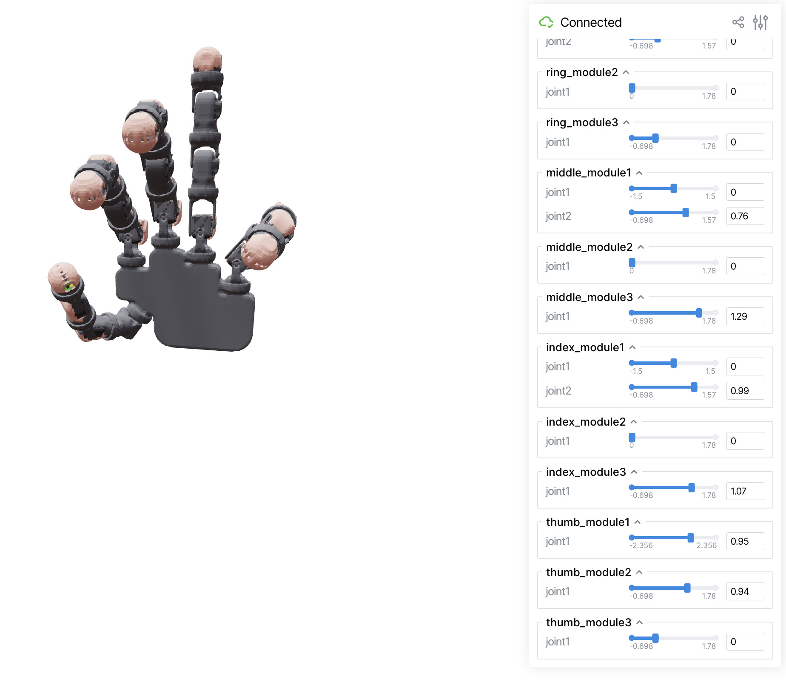

==============
Visualization
==============

For visualization and viewer documentation, see:

- :doc:`../reference/viewers` - Viewer API reference
- :doc:`../examples/index` - Basic visualization examples

Scikit-robot supports multiple visualization backends:

- **TrimeshSceneViewer**: Lightweight, fast rendering
- **PyrenderViewer**: OpenGL-based, smoother rendering
- **JupyterNotebookViewer**: Browser-based, works in Jupyter and Google Colab
- **ViserViewer**: Web-based viewer with interactive joint sliders

Basic usage:

.. code-block:: python

   from skrobot.models import PR2
   from skrobot.viewers import TrimeshSceneViewer

   robot = PR2()
   viewer = TrimeshSceneViewer()
   viewer.add(robot)
   viewer.show()

Selecting a backend by name
---------------------------

Instead of importing a specific class, you can pick a backend by name with
:func:`skrobot.viewers.create_viewer` -- handy for scripts that expose a
``--viewer`` flag. Constructor options the chosen backend does not accept are
ignored, so the same call works for every backend:

.. code-block:: python

   import skrobot

   viewer = skrobot.viewers.create_viewer('pyrender')  # 'trimesh' | 'pyrender' | 'viser'
   viewer.add(robot)
   viewer.show()

Keeping the viewer responsive
-----------------------------

Every interactive viewer provides two helpers:

- ``viewer.wait_until_close()`` blocks until the window is closed, replacing the
  manual ``while viewer.is_active: ...`` loop.
- ``viewer.pause(seconds)`` waits like ``time.sleep`` but keeps the window
  interactive -- use it in animation loops so the camera stays draggable during
  the pause. This matters on macOS, where the trimesh / pyrender GL loop runs on
  the main thread and a bare ``time.sleep`` would freeze the window.

.. code-block:: python

   for av in trajectory:
       robot.angle_vector(av)
       viewer.pause(0.5)   # redraws and holds for 0.5 s; camera stays draggable

ViserViewer
-----------

ViserViewer provides a web-based 3D visualization that opens in your browser.
It automatically generates GUI sliders for each joint, allowing real-time manipulation of joint angles.

.. code-block:: python

   from skrobot.models import PR2
   from skrobot.viewers import ViserViewer

   robot = PR2()
   viewer = ViserViewer()
   viewer.add(robot)
   viewer.show()  # Opens browser automatically

   # Keep the server running until the browser tab is closed
   viewer.wait_until_close()

Features:

- Web-based visualization accessible from any browser
- Interactive joint angle sliders organized by link groups
- Real-time robot pose updates
- Works in headless environments (no display server required)
- Remote access capability over network
